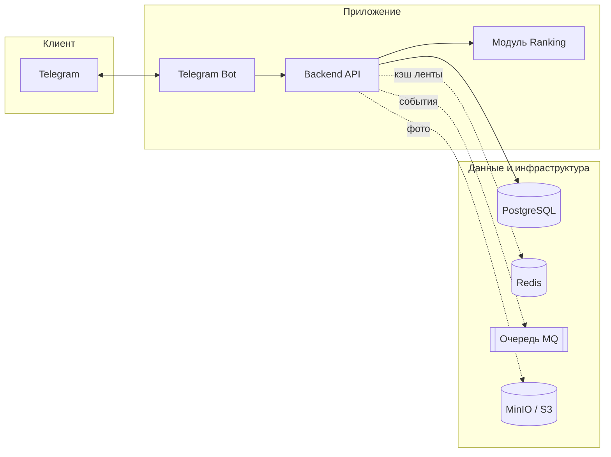
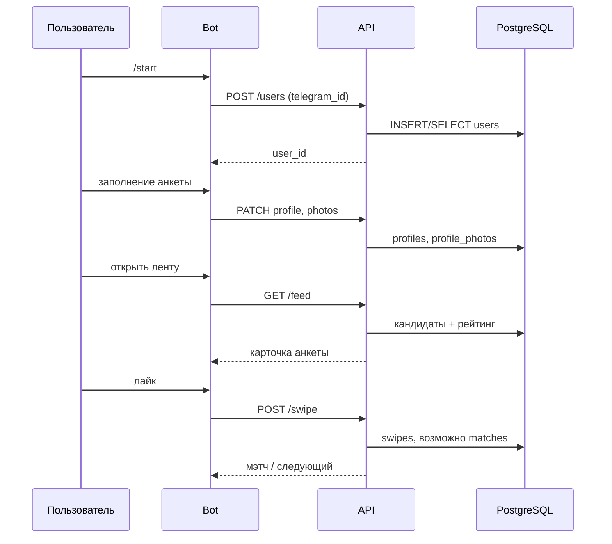

# Архитектура

## Общая схема системы

Пользователь взаимодействует только с Telegram. **Bot** обращается к **Backend API** по HTTPS. Персистентность — **PostgreSQL**; **Redis**, **очередь**, **Celery**, **MinIO** подключаются по мере реализации этапов.

## Потоки данных

### Регистрация и анкета

1. Пользователь → `/start` → Bot → API: создать/найти `user` по `telegram_id`.
2. Пошаговый ввод полей анкеты → API: обновление `profiles`, `user_preferences`, загрузка фото → MinIO + запись `profile_photos`.

### Лента и свайпы

1. Bot запрашивает «следующую анкету» → API: модуль **Ranking** отбирает кандидатов (фильтры + скор), при наличии Redis — сначала из кэша пачки.
2. Пользователь нажимает лайк/пас → API: запись в `swipes`, при лайке проверка обратного лайка → при успехе запись в `matches`, уведомление через Bot.

### Чат после мэтча

1. Сообщения в диалоге → API: запись в `messages` с привязкой к `match_id` и `sender_id`.
2. События могут уходить в очередь для обновления поведенческого рейтинга.

### Рейтинг (фон)

1. Периодически (Celery) или по событиям: пересчёт `primary_score`, `behavior_score`, `combined_score` в `profile_ratings`.

## Сценарии использования

| Сценарий | Участники | Результат |
|----------|-----------|-----------|
| Первый вход | Bot, User | Создан пользователь по `telegram_id`. |
| Создание анкеты | Bot, Profile, MinIO | Заполнен профиль и фото. |
| Просмотр ленты | Bot, Interaction, Ranking | Выдача отфильтрованных и отранжированных анкет. |
| Лайк без взаимности | Interaction | Строка в `swipes`, уведомления о мэтче нет. |
| Взаимный лайк | Interaction | Запись в `matches`, push в Telegram. |
| Переписка | Chat | Сообщения в `messages`, данные для поведенческого рейтинга. |

## Замечания по этапам

- **Этап 2:** Bot + регистрация, минимальный API и таблица `users`.
- **Этап 3:** CRUD профиля, свайпы, мэтчи, алгоритм ранжирования, Redis для пачки анкет.
- **Этап 4:** Celery, оптимизация БД, метрики, деплой; опционально MQ и MinIO, если не сделаны раньше.
