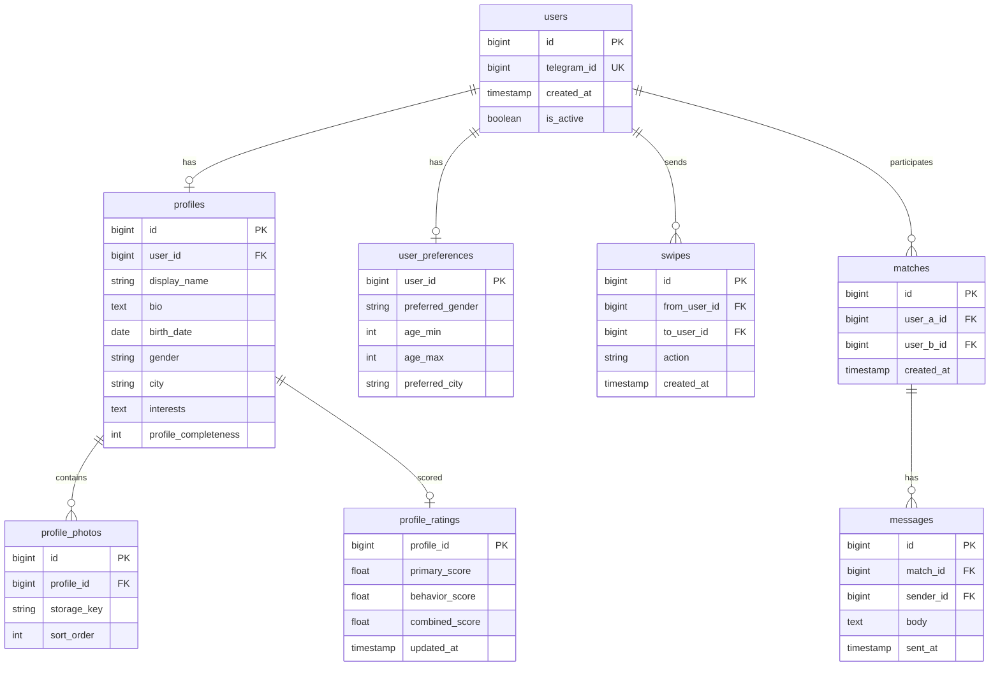

# Схема БД

СУБД: **PostgreSQL**. Создание таблиц: [03-database-schema.sql](03-database-schema.sql).

## Таблицы и связи

| Таблица | Назначение |
|---------|------------|
| `users` | Учётная запись: `telegram_id`, дата создания, активность. |
| `profiles` | Анкета: имя, био, дата рождения, пол, город, интересы, полнота заполнения. |
| `profile_photos` | Фото анкеты: ссылка на объект в S3 (`storage_key`), порядок сортировки. |
| `user_preferences` | Кого ищет пользователь: пол, возрастной диапазон, город. |
| `swipes` | Действия в ленте: лайк/пас; одна запись на пару (кто → кому). |
| `matches` | Взаимный лайк; пара пользователей хранится в каноническом порядке (`user_a_id < user_b_id`). |
| `messages` | Сообщения в чате мэтча. |
| `profile_ratings` | Кэш оценок: первичный, поведенческий, комбинированный скор; время обновления. |

Связи: один пользователь — одна анкета и одни предпочтения; у анкеты много фото; у мэтча много сообщений; у профиля — одна строка рейтинга (при необходимости расширения — версионирование или история в отдельной таблице).

## ER-диаграмма

## Рейтинг и таблицы

| Уровень рейтинга | Источники в БД |
|------------------|----------------|
| Первичный | `profiles`, `profile_photos`, `user_preferences` (и фильтры «кого показываем»). |
| Поведенческий | `swipes`, `matches`, `messages` (время — по `created_at` / `sent_at`). |
| Комбинированный | Агрегаты в `profile_ratings`; рефералы — при внедрении отдельная таблица `referrals`. |

## Индексы (см. также DDL)

В SQL-файле заданы индексы под типичные запросы: свайпы по получателю, сообщения по мэтчу, поиск пользователя по `telegram_id`.
