# Отчёт по практической работе

## 1. Выбранные аномалии

В рамках практической работы были выбраны и продемонстрированы четыре аномалии изоляции:

1. **Dirty Read** — чтение незакоммиченных данных другой транзакции
2. **Non-Repeatable Read** — повторное чтение строки даёт другое значение
3. **Phantom Read** — повторный запрос с условием возвращает новые строки
4. **Lost Update** — обновление одной транзакции перезаписывает другое

---

## 2. Подготовка тестовых данных

Перед демонстрацией каждой аномалии выполнялся скрипт `01_setup.sql`, который создаёт две таблицы и заполняет их данными.

**Результат выполнения setup:**

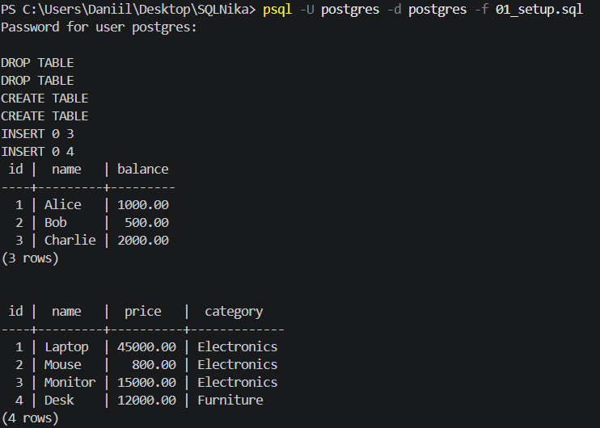

---

## 3. Аномалия 1 — Dirty Read (Грязное чтение)

### Описание

Транзакция T2 читает данные, которые T1 изменила, но **ещё не закоммитила**. Если T1 откатится (ROLLBACK), то T2 уже приняла решения на основе данных, которые никогда официально не существовали.

### Шаги воспроизведения

Демонстрация проводится в двух параллельных сессиях psql.

**Шаг 1 — T1 начинает транзакцию и изменяет данные (без COMMIT):**

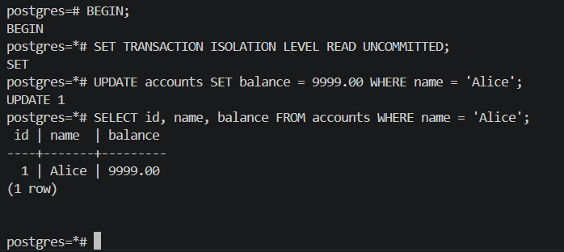


**Шаг 2 — T2 пытается прочитать незакоммиченные данные:**

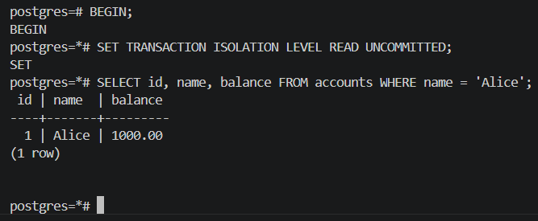


**Шаг 3 — T1 откатывает изменения:**

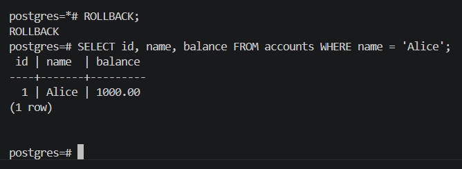

**Шаг 4 — T2 снова читает данные:**

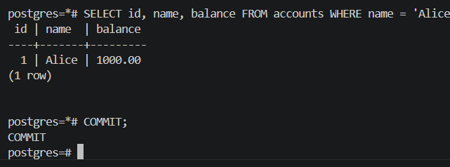


### Вывод

PostgreSQL предотвращает Dirty Read на архитектурном уровне (MVCC): даже при `READ UNCOMMITTED` транзакция видит только закоммиченные данные. В СУБД, допускающих это (например, MySQL с `READ UNCOMMITTED`), шаг 2 вернул бы `9999.00` — значение, которое впоследствии было отменено откатом T1.

**Опасность:** если бы T2 увидела `9999.00` и, например, одобрила кредит на основе этого «баланса», а T1 затем откатилась — решение было бы принято на основе несуществующих данных.

### Как избежать

Использовать уровень изоляции **READ COMMITTED** или выше. В PostgreSQL эта защита встроена по умолчанию.

---

## 4. Аномалия 2 — Non-Repeatable Read (Неповторяющееся чтение)

### Описание

Внутри одной транзакции T1 дважды читает **одну и ту же строку** и получает **разные значения**, потому что между двумя чтениями транзакция T2 изменила эту строку и сделала COMMIT.

### Шаги воспроизведения

**Шаг 1 — T1 начинает транзакцию и читает баланс Alice:**

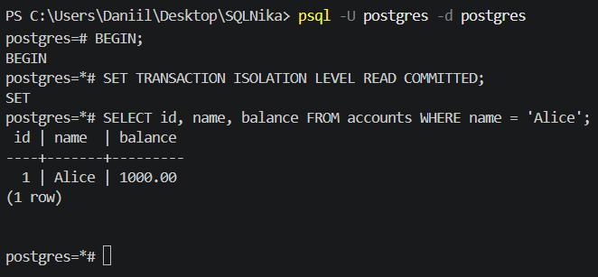

**Шаг 2 — T2 изменяет баланс Alice и коммитит:**

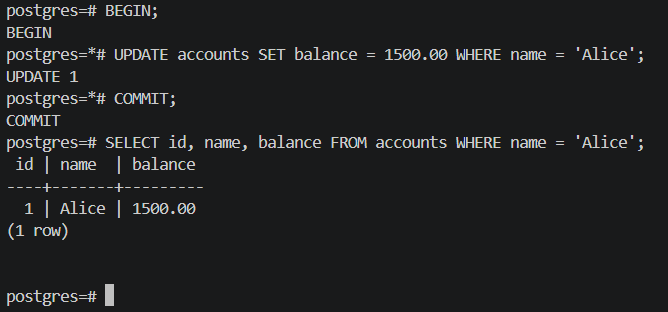

**Шаг 3 — T1 повторно читает баланс Alice в той же транзакции:**

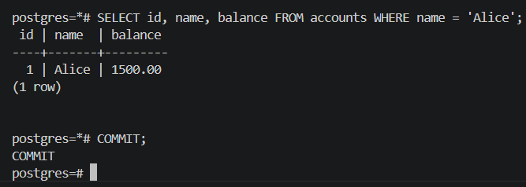


### Вывод

T1 в рамках одной транзакции получила два разных значения для одной строки: сначала `1000.00`, затем `1500.00`. Это нарушает логику работы: например, приложение могло принять бизнес-решение на основе первого чтения (1000), а при повторной проверке уже обнаружить другое значение (1500).

### Как избежать

Использовать уровень изоляции **REPEATABLE READ**. На этом уровне транзакция фиксирует снимок данных в момент своего старта и видит только этот снимок до своего завершения, игнорируя чужие коммиты.

```sql
BEGIN;
SET TRANSACTION ISOLATION LEVEL REPEATABLE READ;
-- теперь повторный SELECT вернёт то же значение
```

---

## 5. Аномалия 3 — Phantom Read (Фантомное чтение)

### Описание

Внутри одной транзакции T1 дважды выполняет запрос с условием `WHERE` и получает **разное количество строк**, потому что T2 добавила новую строку, удовлетворяющую этому условию.

В отличие от Non-Repeatable Read (там меняется значение существующей строки), здесь меняется **состав выборки** — появляется «фантомная» строка.

### Шаги воспроизведения

**Шаг 1 — T1 начинает транзакцию и считает товары категории «Электроника»:**

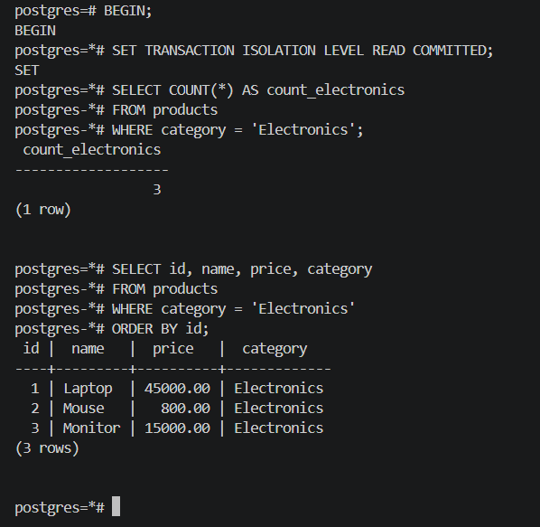

**Шаг 2 — T2 вставляет новый товар в категорию «Электроника» и коммитит:**

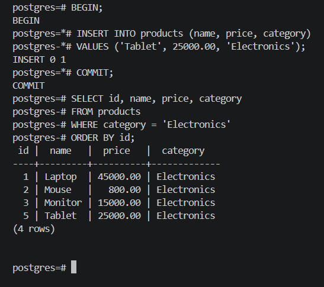

**Шаг 3 — T1 повторно считает товары в той же транзакции:**

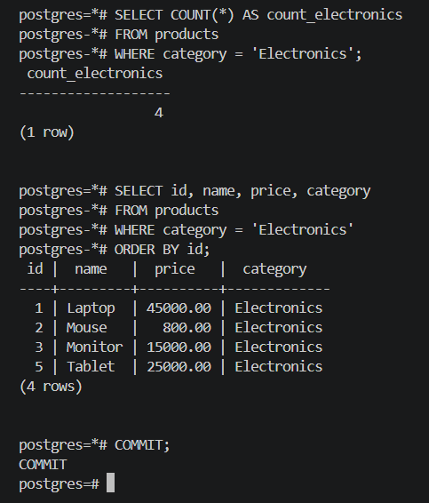


### Вывод

T1 в рамках одной транзакции дважды сделала `COUNT(*)` с одним и тем же условием и получила разные результаты: 3 и 4. «Фантомная» строка «Планшет» появилась между двумя запросами. Это может привести к ошибкам: например, приложение зарезервировало место под 3 товара, а при проверке их оказалось 4.

### Как избежать

Использовать уровень изоляции **SERIALIZABLE** (по стандарту SQL). PostgreSQL также предотвращает Phantom Read на уровне **REPEATABLE READ** (это расширение стандарта).

```sql
BEGIN;
SET TRANSACTION ISOLATION LEVEL REPEATABLE READ;
-- повторный COUNT вернёт то же значение
```

---

## 6. Аномалия 4 — Lost Update (Потерянное обновление)

### Описание

Обе транзакции читают одну строку, вычисляют новое значение на стороне приложения, затем обе записывают результат. Вторая запись **перезатирает** первую, и одно из обновлений бесследно исчезает.

**Сценарий:** у Bob баланс 500. T1 (пополнение счёта) хочет добавить +200. Одновременно T2 (кэшбэк) хочет добавить +100. Правильный итог: 800. Из-за аномалии получится 700.

### Шаги воспроизведения

**Шаг 1 — T1 читает баланс Bob и «запоминает» его:**

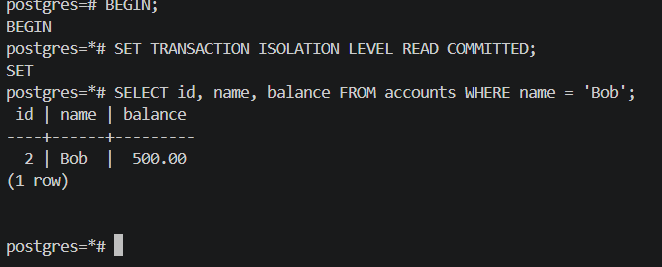

**Шаг 2 — T2 читает тот же баланс, прибавляет 100 и коммитит:**

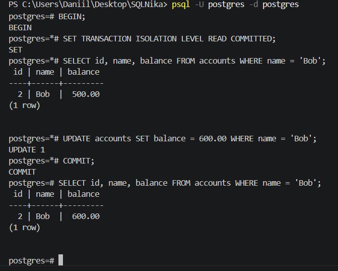

**Шаг 3 — T1 записывает своё вычисленное значение (не зная о T2):**


### Вывод

Итоговый баланс Bob составил `700.00` вместо правильного `800.00`. T1 перезаписала результат работы T2 значением, вычисленным на основе устаревших данных. Обновление T2 (+100) бесследно исчезло.

### Как избежать

**Способ 1 — атомарный UPDATE (рекомендуется):** не читать значение в приложение, а прибавлять прямо в SQL:
```sql
-- Вместо: UPDATE accounts SET balance = 700 WHERE name = 'Bob'
UPDATE accounts SET balance = balance + 200 WHERE name = 'Bob';
-- Сервер выполняет чтение и запись атомарно — конкуренция невозможна
```

**Способ 2 — SELECT FOR UPDATE (пессимистическая блокировка):**
```sql
BEGIN;
SELECT balance FROM accounts WHERE name = 'Bob' FOR UPDATE;
-- строка заблокирована: T2 будет ждать завершения T1
UPDATE accounts SET balance = 700.00 WHERE name = 'Bob';
COMMIT;
```

**Способ 3 — уровень изоляции REPEATABLE READ:**
```sql
BEGIN;
SET TRANSACTION ISOLATION LEVEL REPEATABLE READ;
-- PostgreSQL обнаружит конфликт и выдаст:
-- ERROR: could not serialize access due to concurrent update
-- Приложение должно повторить транзакцию
```

---

## 7. Итоговая таблица

| Аномалия | Уровень воспроизведения | Уровень защиты | Результат в PostgreSQL |
|---|---|---|---|
| Dirty Read | READ UNCOMMITTED | READ COMMITTED | Не воспроизводится (MVCC) |
| Non-Repeatable Read | READ COMMITTED | REPEATABLE READ | Воспроизводится |
| Phantom Read | READ COMMITTED | REPEATABLE READ* | Воспроизводится |
| Lost Update | READ COMMITTED | REPEATABLE READ* | Воспроизводится |

*PostgreSQL предотвращает эти аномалии уже на REPEATABLE READ, что превышает требования стандарта SQL.

---

## 8. Как избежать аномалий — общий принцип

Повышение уровня изоляции защищает от большего числа аномалий, но снижает параллелизм и производительность из-за блокировок. На практике выбирают минимально достаточный уровень:

- **READ COMMITTED** (PostgreSQL по умолчанию) — достаточно для большинства CRUD-операций
- **REPEATABLE READ** — для операций, требующих стабильного чтения (отчёты, финансовые расчёты)
- **SERIALIZABLE** — для критически важных операций, где любая параллельность недопустима

Помимо уровней изоляции, аномалии можно предотвращать на уровне запросов: атомарные `UPDATE SET x = x + n` вместо read-modify-write, использование `SELECT FOR UPDATE` для явной блокировки строк перед изменением.
